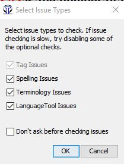
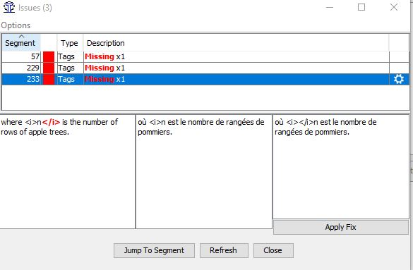

## Check and fix tags

To ensure that all tags have been inserted correctly:

  * Go to **Tools** > **Check Issues** to open the _Issues_ window.
    
    !!! tip inline end
        You may untick the other checks (Spelling, Terminology, LanguageTool) if you want to focus on tags only first.
    
    
  * Press **OK**.
  * An error report will open.
    
    

  * Go through the issues one by one. For every issue in the list, do the following:

    * Click a row in the list (or click on **Jump to Segment**) to open that segment in the editor
    * Fix the tag issue (as explained in the [Fixing tag issues](../tags/#fixing-tag-issues){:target="_blank"} section)
    * Press the **Refresh** button to update the list of issues.

!!! failure "Avoid"
    Please do not click on "Apply fix"  fix each issue manually.

!!! tip
    If the source text has tags that you do not use in your language, you can insert them at the end of the segment to avoid having false positives in the error report. That should not have an impact on the translation.

