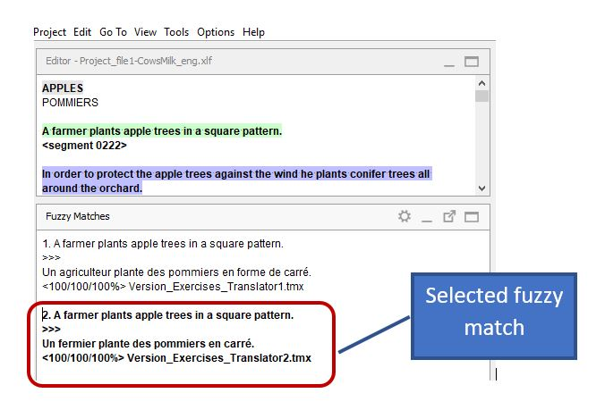

# Reconciling using Fuzzy matches (++ctrl+i++)

For reconciliation, the translations from **translator 1** and **translator 2** are handled as fuzzy matches and are displayed in the **Fuzzy matches** pane. 

A reconciler's task in practice consists of:

  * inserting in **full the suggestion** from translator 1 or translator 2 **OR**
  * inserting **a part of the suggestion** from translator 1 and completing with part of the translator 2 **OR**
  * **translating the segment from scratch** if no suggestions are satisfactory

By default, the suggestion from translator 1 is selected. It is the first one in the list and it is displayed in** bold**. If you want to use the suggestion from translator 2 you need to activate it by **double click** it on it. The second fuzzy match (suggestion from translator 2) becomes bold.

To insert the fuzzy match in full, press ++ctrl+i++ on your keyboard. After inserting it, do not forget to make the necessary changes so that it fits the segment you are reconciling.

Alternatively, you can also insert only a part of the fuzzy match or combine several matches:

  * Activate the match you want use
  * With your mouse, select the part you wish to insert
  * Press ++ctrl+i++ on your keyboard to insert it 
  * Select another fuzzy match if appropriate or finish translating the segment

Please remember that it is important to make sure the final translation is **harmonized** as the two translators may use different terms and styles. To ensure this, make sure you preview the item prior to delivery and perform concordance searches on recurring instructions and terminology.