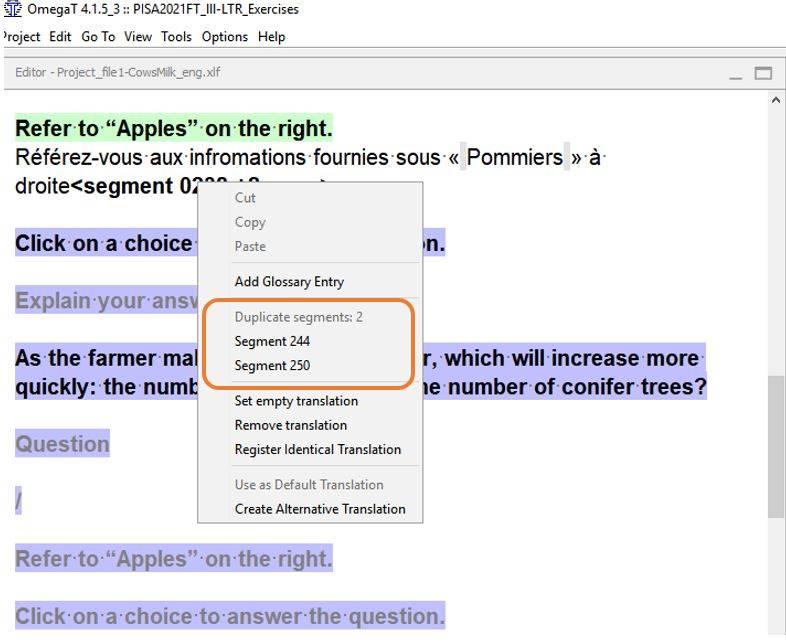
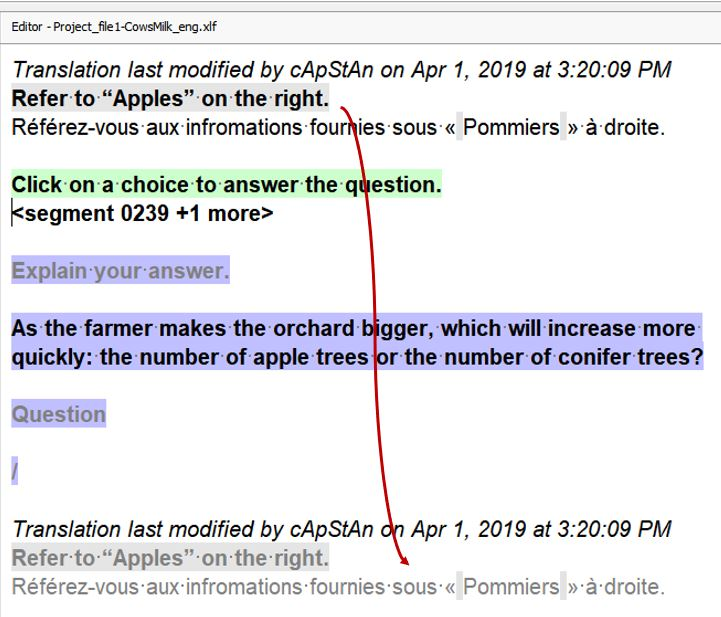
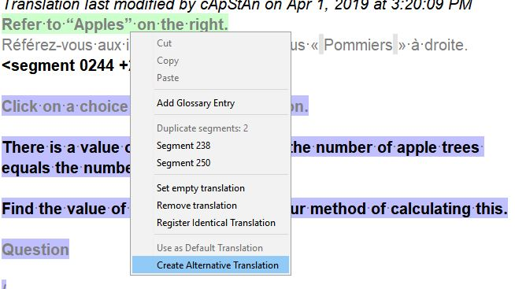

# Handling repetitions

Some segments may be **repeated** in the project. By default, the translation of a repeated segment is __autopropagated__ to all its instances.

## Identifying repeated segments

You can recognize that you are in a repeated segment because the **Segment Properties** pane will show a field called **Is duplicate** (with value `FIRST` for the first repetitions and value `NEXT` for any others).
<!-- @todo: in the navigation across panes add segment properties -->
<!-- @todo: update "navigation across panes" > "navigation through panes" -->

  
  <!--  -->
   
  <!-- @todo: harmonize font size across all screenshots and gifs -->

Also, the segment number also includes how many more repetitions the active segment has.

Also, repeated segments from the second instance onwards have grey font, which could help you realize they are instances of a repeated segment.
<!-- @todo: repetitions in black and gray font -->

If you **right click** on a repeated segment, the contextual menu will list all the other instances. It can be useful to jump to them (by clicking on one of them from the contextual menu) to see the different contexts in which that repeated segment appears in the project.

  

## Autopropagation

When you edit the translation of a repeated segment, as soon as the edit is saved the changes will be automatically reflected in all the repetitions in the project.

  

## Create alternative translation

In some cases, two instances of a repeated segment might need to be translated differently in different contexts. In that situation, you may want to modify the translation of only one of the repetitions without altering the rest. 

In other words, you must create an **alternative translation** to prevent _auto-propagating_ your update. 

To create an **alternative translation**: 

  1. _Right click_ on the segment and choose **Create Alternative Translation** from the contextual menu.
    <!--  -->
  2. Edit the translation of the active segment.
  3. Press ++ctrl+s++ to register the alternative translation.
    <!--  -->
    <!-- @todo: use the example from the slides -->

The **Multiple Translations** pane will show the different translations.

The following video shows how to create alternative translations, enjoy :octicons-heart-fill-24:{ .heart }:
<iframe title="vimeo-player" src="https://player.vimeo.com/video/789832289?h=5fd29f998e" width="640" height="401" frameborder="0" allowfullscreen></iframe>

And here's a quick summary: 

<!-- @todo for Danina: repeat video, Ctrl+S for every segment! -->

!!! danger
    Alternative translations may be treacherous if not applied correctly. Make sure you follow the three steps above precisely.