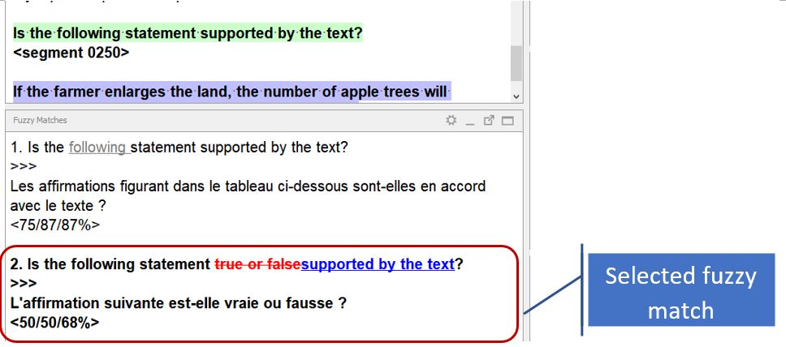
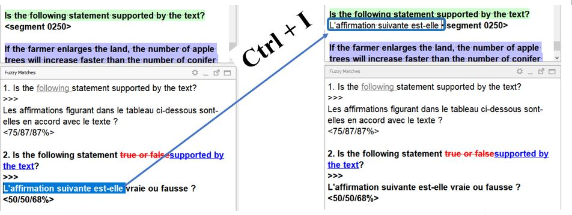

# Using matches

When you translate, your translations are saved in the project’s translation memory. When you activate a segment which is similar to one you have already translated, you will see suggestions appearing in the fuzzy matches pane. 

The source text in the Fuzzy Matches pane uses “track changes” mode to show the difference (e.g. {~~old~>new~~}) between the new source text in the active segment and the source text in the fuzzy match selected.

  * Parts that do not appear in the active segment are {~~stricken through~>~~}
  * Parts that are added are in {~~~>underlined~~} <!-- ^^underlined^^ -->

    
    <!-- normalize text size in screenshots -->

When there are several fuzzy matches for a segment, they are sorted by their similarity to the new segment. The active fuzzy match is the one in **bold**. By default, it will be the first one in the list. If you want to use a different fuzzy match, **double click** on it to activate it. 

To insert the fuzzy match in full, press ++ctrl+i++ on your keyboard. After inserting it, do not forget to make the necessary changes so that it fits the segment you are translating.

Alternatively, you can also insert only a part of the fuzzy match or combine several matches:

  * Activate the match you want use
  * With your mouse, select the part you wish to insert
  * Press ++ctrl+i++ on your keyboard to insert it 
  * Select another fuzzy match if appropriate or finish translating the segment

