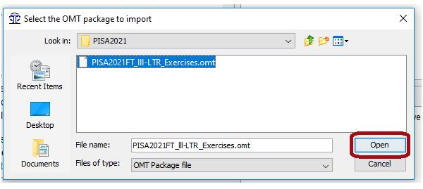
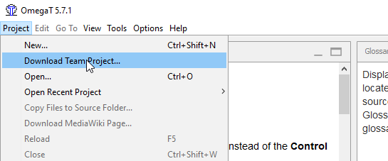
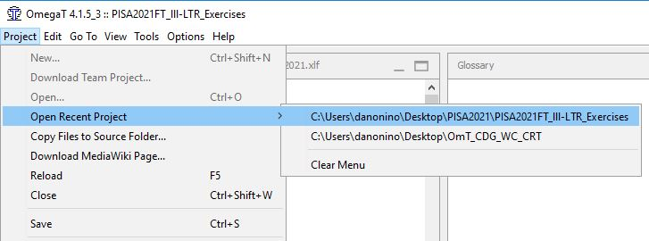

# Accessing the project

!!! tip
    Please give some thought to the organization of your files and folders before you proceed with the steps below. We provide some tips [here](../../tips/#file-organization){:target="_blank"}.
    <!-- @todo: add file organization tips -->

## Accessing a new project

There are two ways you may access a project for the first time, depending on whether it is an **online project** (or _team project_) or an **offline project**. 

+ If you must work on an **offline project**, you will receive a new OmegaT project package (aka an OMT package, or a file with `.omt` extension). Go to the section [Unpacking an offline project](#unpacking-an-offline-project) below to see what you must do to unpack a project package.

+ If you must work on an **online project** (or **team project**), you will receive the URL to the repository where the OmegaT project is hosted. Go to the section [Downloading a team project](#downloading-a-team-project) below to see what you must to do download a team project from a repository.

If you're not sure whether your project is online or offline, it's very easy: if you receive an OMT package, the project is offline, and if you receive a URL to a git repository, the project is online.

| You receive     | Project is |
|-----------------|---------|
| OMT file        | offline |
| URL to git repo | online  |

!!! caution
    Unpacking or downloading an OmegaT project (depending on the distribution mode) needs to be done _only once_ for each project. After you have unpacked or downloaded a project, you can simply [re-open it from the list of recent projects](re-opening-an-existing-project).
    <!-- @todo: " If you unpack the OMT file again, you might overwrite your changes and lose your work." to be tested... -->

### Unpacking an offline project

If you receive an OMT package, you must unpack the project (from the OMT package) to access the project for the first time. 

To unpack a project, follow these steps: 

1. Store the OMT package in the folder where you would like to create the OmegaT project.<!-- @todo: tips on file organization -->

2. To unpack the project from the OMT package:
  
    + Launch OmegaT.
  
    + Go to **Project** > **Unpack project from OMT file**:<!-- @todo: update screenshot -->

        
        <!-- @todo: update screenshot, current version -->

        <!-- { align=right } -->

    + Navigate to the location where you stored the OMT package. Select the **OMT package** and click on Open:
  
        

    + A pop up opens. Click **Yes**.
  
         

4. You can now perform your task in the project.

### Downloading a team project

If you receive a URL to a git repository, you must download the team project from that repository to access the project for the first time.

!!! info 
    The URL should look a bit like this: `https://some-bar-domain.com/some/path/to/the/foo-repository.git`.

#### Authentication

At some point during the steps below, or afterwards, OmegaT will ask you to authenticate, so please make sure you have your credentials at hand. OmegaT might ask you to authenticate one, two or perhaps three times (depending on the project settings), please just enter the same credentials as many time as needed.

#### How to download the project from the repository

To download the team project, follow these steps: 

1. Define a location in your machine where you would like to create the OmegaT project. Let's assume it's `C:/Work/` (but please use whatever path is appropriate on your end). <!-- @todo: tips on file organization -->

    !!! caution
        Make sure that location is not inside a sync'ed folder such as Dropbox or the like.

2. [Copy](../../tips/#how-to-copy-paste-a-url){:target="_blank"} the URL of the project repository.
    

3. In OmegaT, go to **Project** > **Download Team Project**.
    <!-- @todo: update screenshot -->
    <!--  -->
    
    <!-- That will open the **Download Team Project** dialog. -->
    <!--  -->

4. In the **Download Team Project** dialog, click in the **Repository URL** field and then press ++ctrl+v++ to paste the URL from your clipboard.

5. Click in the **New Local Project Folder** field. OmegaT will propose a path to the location where it will create the project folder. 
    <!--  -->
    

6. You might want to modify that path to create the folder in the location that you have defined in the first step above. To do that:

    + Copy the path to the location where you want to create the project, e.g. `C:/Work/`. 
    
    + Then, in the **New Local Project Folder** field, select the part of the path up to the slash before the project folder and delete it.
    + Then, press ++ctrl+v++ to paste your path in replacement of the deleted part. 
    

    !!! Caution
        Make sure there's a slash between the path that you paste and the project folder name.

## Closing the project

When you are done working for the day, quit OmegaT (++ctrl+q++).

## Re-opening an existing project

After you have received and opened a project for the first time, the project exists in your machine and OmegaT will remember it. 

The next times you want to access the project in OmegaT, go to **Project** > **Open Recent Project**. The project you were working on will appear in the list:

   

!!! note
    Make sure the disctinction between _opening_ a **recent** project and _downloading_ or _unpacking_ a **new** project (depending on the distribution mode) is clear. You can open a project that already exists only after you have already unpacked it or downloaded it. In turn, you only need to download or unpack (once) a project that doesn't exist yet in your machine.
