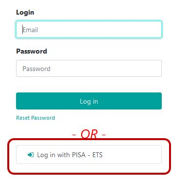
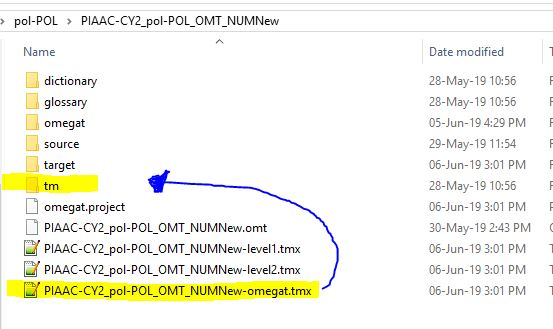
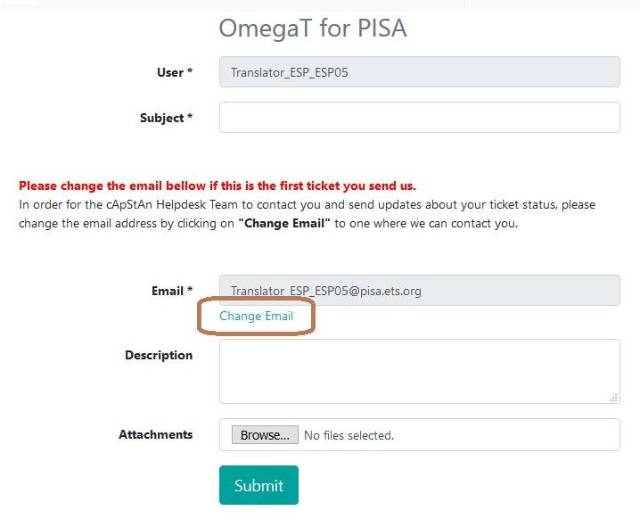

# FAQ

<!-- 
## [ALL] How can I contact the helpdesk ?

To contact the OmegaT helpdesk for OmegaT related questions:

  * go to [https://pisa.capstan.be](https://pisa.capstan.be) (if you work on PISA) or [https://piaac.capstan.be](https://piaac.capstan.be) (if you work on PIAAC)

  * Click on **Sign in** on the top right corner
  * Press **Log in with PISA-ETS** (if you work on PISA) or **Log in with PIAAC-ETS** (if you work on PIAAC)

  * Enter your portal credentials (the same ones you use to preview the units on the portal). If you don't have your portal credentials, please contact your NPM or PM (if you are a cApStAn verifier)
  * Click on OmegaT Helpdesk
  * Replace the default email with your real email as explained 
  * Explain your issue clearly in the Description field, write a short summary of your issue in the Subject field and attach any files you want to illustrate the issue. 

All the above steps are also described in the following  
-->

<!-- unnecessary because the "country's version" will always be available in the mapped repo in PISA 2025

## [VER] How can I make sure I always see the country's version in the Fuzzy matches pane ?

Before you make any changes in the project, press ++ctrl+D++ on your keyboard to generate the target files. Then go to **Project>Access project contents>root**. 

You will see 3 different translation memories (.tmx) files. Copy the last one ending with "-omegat.tmx" and paste it in the **tm** folder. 

-->

<!-- this does not belong in an omegat guide...

## It's been 2 days and I haven't received a notification about a reply to my ticket. Is this normal ?

This is not normal. Our policy is to reply to tickets within a maximum of 48 working hours. If you haven't received a notification, it is possible that you have not changed the e-mail address on the helpdesk. When you send us a ticket please make sure to click on the "Change Email" button. 

Replace the fictitious e-mail TRANSLATOR_LLL_00x@project.ets.org with your real e-mail address.

You can also change your e-mail information by click in the top right menu after logging in.

-->

## Can I export the contents of the OmegaT Project in Excel ?

Yes. To export the contents of the OmegaT project in Excel, go to **Tools** > **Write Project to Excel**.

To access the exported Excel, go to **Project** > **Access Project Contents** > **Root**. The Excel will be found in the **script_output** folder.

!!! warning 
    Please remember that the Excel file cannot be reimported in OmegaT. Any change you make in the Excel needs to be reflected in the OmegaT project.

## The text is too small. Can I change the font size in OmegaT?

To change the font size go to **Options** > **Preferences** > **Font**. 
Increase the font size to one you find suitable. This has not impact on the actual font size in the target files. It only changes the display in OmegaT.

## How do I install the spellchecker files?

A spellchecker is available in OmegaT. Go to **Options > Preferences > Spellchecker.**
Click on **Install new dictionary** and choose the spellchecker for your language.

<iframe title="vimeo-player" src="https://player.vimeo.com/video/780395752?h=5a92c211b3" width="640" height="447" frameborder="0" allowfullscreen></iframe>

You should see the URL `[https://cat.capstan.be/OmegaT/hunspell/](https://cat.capstan.be/OmegaT/hunspell/)`.

A list of languages will open. Select the appropriate language for your country and press OK (e.g. *es_AR - Spanish (Argentina)* if your language is Spanish and your country is Argentina). Press the **Install** button.
You can close the remaining pop up window. The spellchecker is now installed.

## There is no spellchecker for my language. What should I do ?

If you cannot find your language in the list when you go to **Options>Preferences>Spellchecker.** and then clicking on **Install new dictionary**, please contact the helpdesk and our team will try to find a spellchecker for you.
Please note that we may not be able to find a spellchecker for all languages.

## What should I do if I don't have the Import OMT Package feature within the Project menu?

If you do not see the **Import OMT Package** option in the Project menu, please download and run the customizer again: .
If you still cannot see the **Import OMT Package** option, please contact the Helpdesk.

## When I translate, I like to overwrite the source text with the target. Can I insert the source text in the target segment automatically and then start translating?

The answer is yes. To do so, go to **Options>Editor** in OmegaT. Then tick the option "Insert the source text" and press OK. 

 

In OmegaT, when you navigate from one segment to another, the source text will be automatically inserted each time. 

## I made a mistake in a term I added to the glossary. Can I correct it?

The answer is yes. To access the glossary, go to **Project>Access Project contents>Glossaries**

The Glossaries folder will open. It context a .txt file named "glossary.txt". Double click on it to open it in your text editor. 

Correct any term that contains an error and Save the file. 

## As an NPM, how can I send the files to my translation team?

Please **do NOT** send them by e-mail. You should find a password protected, secure channel (e.g. Google Drive or Dropbox is at least accepted for PIAAC as long as the folders are password protected and the users need to insert a password when connecting, it's ok).

## Do we have access to the translation memories from the previous cycle if we already took part in the project?

The answer is yes. You can access it in two different ways:

  * from OmegaT: the translation memory per domain from the previous cycle is included as reference in the OmegaT packages. 
  * from  which contains translations from all previous cycles of the project for your language.

## Is it possible to access MemoryLn with a translator account?

The answer is yes. MemoryLn can be accessed by logging in to the portal. If you have portal credentials you can access MemoryLn for your language by default, independently of the role you have in the project.

## Can I export the XLIFFs and work in Trados or another CAT tool?

The answer is no. OmegaT was specifically customized to edit the files you are working on. Such a customization is not possible in Trados or memoQ. Removing the files from the OMT package and translating them separately may damage the files and render them unusable on the portal.

## In omegaT is it possible to search for translation by the target? Or it’s only possible by source?

The answer is yes. Press ++ctrl+f++ on your keyboard (without selecting anything in the source segment). The search window opens. Type the text in your language you are searching for and press the** Search** button. 

## When I reconcile I only see suggestions from translator 1 for certain segments. Is it normal?

The answer is yes. When you only see 1 suggestion in the fuzzy matches pane, it means the two translators have proposed the exact same translation. Next to the fuzzy match from translator 1 you will also notice it is written +1 more.

## Why is my OMT package rejected in the portal and how I can fix it?

It is required that all segments are translated at the end of both translation and reconciliation tasks. To ensure this is the case, uploaded projects are checked for completion in every workflow step when you try to finish the task. If it is detected that some segments are not translated in the project, it is not possible to finish the task. 

How do you know whether all segments are translated in your project? You can go to **Tools > Statistics** to obtain a report of the project statistics. If the "Remaining" or "Unique remaining" rows do not show "0", that means that some segments are not translated. Also, if you press shortcut ++ctrl+u++, OmegaT will open the next untranslated segment.

How can you fix this? You guessed it! Translate all remaining segments, then export the OMT package again, upload it again and then try to finis the task again. 

