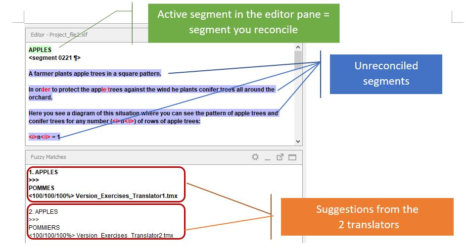
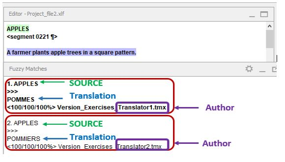

# Quick walkthrough (for reconciliation)

1. **Download the package** for reconciliation and the Excel document from the portal 

2. **Import the OMT package** in OmegaT as described in the section  

3. The OmegaT project for reconciliation will open:

    + All segments will appear **untranslated** in the Editor pane (the main pane of OmegaT, which contains the source text). To find out how to recognize reconciled segments from unreconciled ones and from potential trend segments, please refer to the section 
  
    + The** suggestions from Translator 1 and Translator 2** for the active segment (green) appear below, in the **Fuzzy matches pane** 
     

    + In the Fuzzy matches pane, the suggestions from the 2 translators display the __source text of the active segment__, the __suggested translation for the active segment__ as well as the __identity of the author__. 
     

    + By default, the suggestion from translator 1 appears in bold. It means it is selected. If you want to insert it, no need to retype the text, you can simply press ++ctrl+i++ on your keyboard and it will appear below the active segment. 
  
    + To learn how to reconcile and insert the suggestions from translator 2 or how to combine both, please read the section 
  
    + You can preview the file you are reconciling on the portal. Please consult the section [Creating the target file](_includes/omt-targets.md) to learn how to create and access the reconciled file. This is the file you will have to drag and drop on the portal for preview.
  
    + If you notice **errors in formatting** while previewing (e.g. words that are bolded in your language but were not bolded in the source, or vice-versa), please consult the section [Fixing tag issues](_includes/omt-tag-iss.md) to learn how to correct them.

    + If you notice identical source sentences that need to be reconciled differently, please consult the section [Create alternative translation](_includes/omt-alt-trans.md)

4. After performing a few **QA checks**, most importantly the [Completion check](_includes/omt-qa-comp.md), you can create the reconciled package and deliver it on the portal. 

5. To **create the reconciled package**, go to **Project>Export OMT package** in OmegaT. More details about how to create the package for delivery can be found in the section [Exporting the package for delivery](_includes/omt-pack.md)